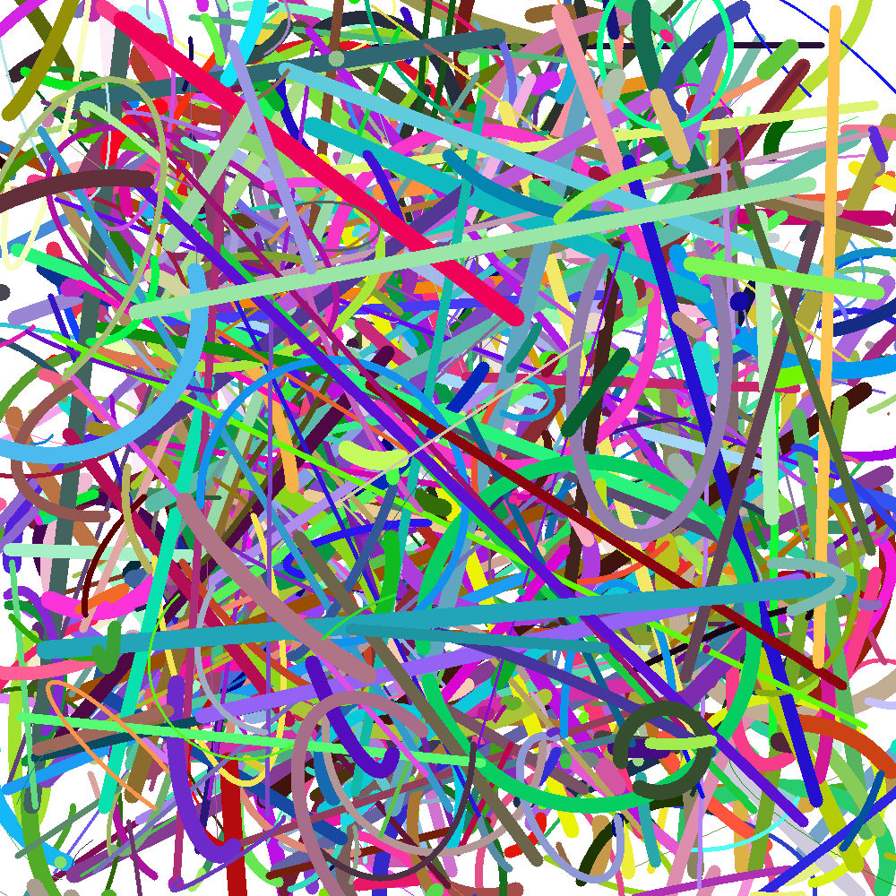

# Abstract Artist

This project is an attempt at simulating the drawing process of abstract modern arts.

## How do I use this?

Download and execute the executable.
Promising values have been 1000 px Size and 1000 Strokes.

## How do I build this myself?

Set up an OpenCV installation on your computer (I will not go into the details, descriptions are to be found [in the internet](https://docs.opencv.org/2.4/doc/tutorials/introduction/table_of_content_introduction/table_of_content_introduction.html#table-of-content-introduction)). 
Include the cpp file in your projects folder.

Disclaimer: I personally love abstract art but could not ignore the similarity between produced works and popular abstract art.
